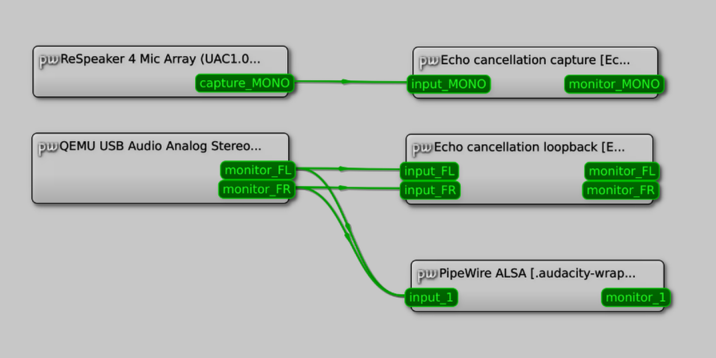

# PipeWire issue #4401 reproduction

This repository contains a VM designed to reproduce [pipewire#4401](https://gitlab.freedesktop.org/pipewire/pipewire/-/issues/4401).

## Usage

1. Install [Nix](https://nixos.org/download) (not the OS - just the package manager, which can be installed on any Linux distribution).

2. Connect a USB microphone to your computer (this bug involves removing a USB microphone, but QEMU can only emulate a speaker, so we need a real one).

3. Build the VM using the vendor and product IDs of the microphone (try `lsusb` if unsure):

   ```console
   $ nix-build -I nixpkgs=channel:nixos-unstable \
       --argstr vendorId 0x1234 \
       --argstr productId 0xABCD
   ```

   _To use the exact Nixpkgs revision available at the time of writing, use `-I nixpkgs=https://github.com/NixOS/nixpkgs/archive/76612b17c0ce71689921ca12d9ffdc9c23ce40b2.tar.gz`._

4. Launch the VM (as root if USB devices cannot be opened), and wait for it to boot:

   ```console
   # result/bin/run-nixos-vm
   ```

5. Open qpwgraph and Audacity (the password is `root`):

   ```console
   $ ssh -Y root@localhost -p 2022 'qpwgraph & audacity'
   ```

6. Start recording in Audacity.

7. In qpwgraph, disconnect the Audacity input link, and instead connect the
   speaker monitor streams to it.

8. The graph should look something like this:

    

9. Optional: Run `speaker-test`. You may not be able to hear anything if QEMU
   is running as root and cannot connect to your sound server, though.

   ```console
   $ ssh -X root@localhost -p 2022 speaker-test
   ```

10. While watching the Audacity window, physically disconnect the microphone.
   Audacity freezes. This is the bug: Playback should not be affected by
   disconnecting the microphone. If you are running `speaker-test`, the audio
   should stop physically playing at this point too.

11. Reconnect the microphone. Audacity resumes. Physical audio, however, does
    not - potentially due to a second bug?

12. Disconnect the link between the microphone and the echo cancellation capture
    sink, and repeat the experiment. Audacity does not freeze this time. This
    indicates that the issue is caused by the USB device being removed while the
    link is active.